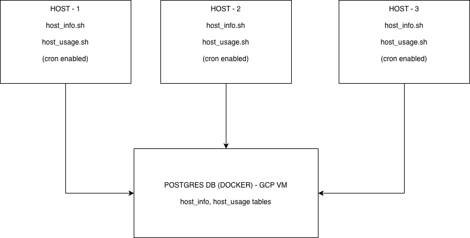

## Introduction

This project is a lightweight monitoring solution for small Linux clusters. It collects static host details and real-time usage metrics (CPU, memory, disk, load) from Linux nodes, stores the data in a PostgreSQL database, and makes it easy for administrators to query historical trends. Primary users are system administrators and developers who need simple visibility into server health. The implementation uses **Bash** for data-collection scripts, **Docker** to host PostgreSQL, **cron** for scheduling, **GCP** (a VM) to run agents, and **GitHub + Gitflow** for version control.

## Quick Start

Follow the steps below to set up and run the Linux Cluster Monitoring system.

1. **Start the PostgreSQL Docker Container**  
Use the `psql_docker.sh` script to create or start a PostgreSQL instance:  
`./psql_docker.sh create`  
`./psql_docker.sh start`
`./psql_docker.sh stop`

2. **Create the Database**  
Create the `host_agent` database inside the running PostgreSQL container:  
`psql -h localhost -U postgres -c "CREATE DATABASE host_agent;"`

3. **Create Database Tables**  
Run the DDL script to create the required tables:  
`psql -h localhost -U postgres -d host_agent -f sql/ddl.sql`

4. **Insert Hardware Specifications**  
Run the hardware info script to insert static host hardware data:  
`./host_info.sh`

5. **Insert Real-Time Usage Metrics**  
Run the usage script to record CPU and memory usage:  
`./host_usage.sh`

6. **Set Up Crontab for Automated Data Collection**  
Schedule `host_usage.sh` to run every minute:  
Edit the crontab using `crontab -e` and add the following line:  
`* * * * * bash ~/your_path/host_usage.sh > /tmp/host_usage.log`

## Implementation

The Linux Cluster Monitoring system collects hardware information and live usage metrics from multiple Linux hosts and stores them in a PostgreSQL database running in Docker on a GCP VM. The system uses Bash scripts for automation and cron for scheduling. Git and Gitflow were used for version control

## Architecture

### Diagram

The Linux Cluster Monitoring system consists of multiple Linux hosts (agents) and a central PostgreSQL database running in Docker on a GCP VM. Each host runs data collection scripts to gather hardware and usage metrics, which are then sent to the central database.

- **Linux Hosts (Agents)**:  
  - Run `host_info.sh` to collect static hardware information.  
  - Run `host_usage.sh` to collect real-time CPU, memory, disk, and load metrics.  
  - The usage script is scheduled via cron for automated periodic data collection.

- **GCP VM with PostgreSQL (Docker)**:  
  - Stores the collected data in two tables: `host_info` and `host_usage`.  
  - Acts as the central repository for all host metrics.

- **Data Flow**:  
  - Scripts on each host push metrics to the PostgreSQL database.  
  - The database can be queried to analyze trends, monitor performance, and identify resource bottlenecks.

## Scripts

The project includes several scripts and SQL files to manage data collection and database operations.

`psql_docker.sh` is used to start, stop, or create the PostgreSQL Docker container: `./psql_docker.sh start`, `./psql_docker.sh stop`, `./psql_docker.sh create`.

`ddl.sql` is the database definition script that creates the required tables (`host_info` and `host_usage`) in the PostgreSQL database: `psql -h localhost -U postgres -d host_agent -f sql/ddl.sql`.

`host_info.sh` collects static hardware information such as CPU model, cores, RAM, disk layout, and network interfaces, and inserts it into the `host_info` table: `./host_info.sh`.

`host_usage.sh` collects live metrics including CPU %, memory usage, disk free space, and load average, and inserts it into the `host_usage` table: `./host_usage.sh`. This script is scheduled via cron for automated data collection every minute.

## Database Modeling

The project uses two main tables to store hardware and usage data.

**host_info** stores static hardware information for each host:

| Column         | Type         | Description                                   |
|----------------|--------------|-----------------------------------------------|
| id             | SERIAL       | Primary key, unique host identifier          |
| hostname       | VARCHAR      | Hostname                                      |
| cpu_number     | INT2         | Number of CPU cores                           |
| cpu_architecture | VARCHAR    | CPU architecture (e.g., x86_64)              |
| cpu_model      | VARCHAR      | CPU model name                                |
| cpu_mhz        | FLOAT8       | CPU frequency in MHz                           |
| l2_cache       | INT4         | L2 cache size (KB)                             |
| total_mem      | INT4         | Total memory in MB                             |
| timestamp      | TIMESTAMP    | When the row was recorded                      |

**host_usage** stores real-time metrics collected periodically from each host:

| Column          | Type       | Description                                   |
|-----------------|------------|-----------------------------------------------|
| timestamp       | TIMESTAMP  | When the usage metrics were recorded         |
| host_id         | SERIAL     | Foreign key referencing `host_info(id)`      |
| memory_free     | INT4       | Free memory in MB                             |
| cpu_idle        | INT2       | CPU idle percentage                            |
| cpu_kernel      | INT2       | CPU usage by kernel                            |
| disk_io         | INT4       | Disk I/O activity                              |
| disk_available  | INT4       | Free disk space in MB                           |

## Test

To ensure the Linux Cluster Monitoring system works correctly, we performed both manual and integration testing.

- **Manual Testing:**  
  - Ran `host_info.sh` on each host to verify that hardware details were collected and inserted correctly into the `host_info` table.  
  - Ran `host_usage.sh` to confirm CPU, memory, disk, and load metrics were captured accurately.

- **Integration Testing:**  
  - Started the PostgreSQL Docker container using `psql_docker.sh`.  
  - Executed `ddl.sql` to create the database schema.  
  - Verified end-to-end functionality: scripts ? database ? sample queries.

- **Cron Validation:**  
  - Installed the cron job for `host_usage.sh` and monitored the log file to ensure metrics were collected automatically at the scheduled intervals.

**Result:**  
- All scripts successfully inserted valid data into the database.  
- Automated data collection worked reliably with cron.  
- The system provided accurate host metrics that could be queried for trend analysis.

## Deployment

The Linux Cluster Monitoring system is deployed using Docker, crontab, and Git for version control.

- **PostgreSQL Deployment:**  
  The database runs inside a Docker container on a GCP VM. The `psql_docker.sh` script manages starting, stopping, and checking the container status.

- **Script Deployment:**  
  The monitoring scripts (`host_info.sh` and `host_usage.sh`) are placed on each Linux host. `host_info.sh` is run once to collect static hardware info, while `host_usage.sh` is scheduled using cron for periodic collection.

- **Automation via Cron:**  
  `host_usage.sh` is scheduled to run every minute on each host to ensure continuous data collection. 

## Improvements

Here are some potential enhancements for the Linux Cluster Monitoring system:

- **Data Visualization Dashboard:**  
  Integrate with tools like Grafana or Kibana to visualize historical metrics and trends for easier analysis.

- **Alerting & Notifications:**  
  Add automated alerts via email or Slack when hosts exceed CPU, memory, or disk thresholds.

- **Scalability & Load Handling:**  
  Optimize scripts and database design to handle larger clusters with dozens or hundreds of hosts efficiently.
